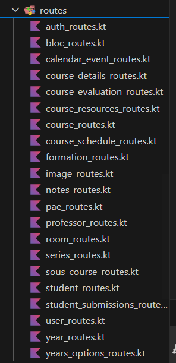
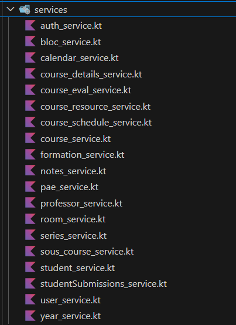
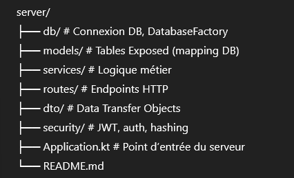

# CompanionAppStudent — Backend Server

## 1. Contexte et rôle du backend

Le backend du projet **CompanionAppStudent** constitue le cœur logique et technique de l’application.
Il est responsable de la gestion des données académiques, de l’authentification des utilisateurs,
de l’application des règles métier et de l’exposition d’une API sécurisée à destination du frontend.

Ce backend a été développé dans un **contexte académique**, avec pour objectif :
- de mettre en pratique une architecture backend moderne,
- d’assurer une séparation claire des responsabilités,
- et de rester évolutif vers une solution dite *production ready*.

Les choix techniques ont été guidés par la lisibilité, la maintenabilité et la cohérence avec les contraintes du projet.

---

## 2. Rôle du backend par rapport au frontend

Le backend joue le rôle de **source unique de vérité** pour l’application.
Le frontend ne communique jamais directement avec la base de données.

Les responsabilités du backend incluent :
- l’authentification et l’autorisation des utilisateurs,
- la validation des données entrantes,
- l’application des règles métier,
- l’accès et la transformation des données,
- la sécurisation des routes via JWT,
- l’exposition de réponses JSON stables via des DTO.

Le frontend se limite à :
- l’affichage des données,
- l’interaction utilisateur,
- l’appel des endpoints API.

Cette séparation garantit :
- une meilleure sécurité,
- une indépendance frontend/backend,
- une API stable et testable.

---

## 3. Architecture générale du backend

Le backend repose sur une **architecture en couches (layered architecture)**,
largement utilisée dans les applications backend professionnelles.

Les principales couches sont :

- **Routes**
  - Définissent les endpoints HTTP
  - Gèrent les requêtes et réponses
  - Ne contiennent aucune logique métier

  

- **Services**
  - Contiennent la logique métier
  - Appliquent les règles fonctionnelles
  - Orchestrent l’accès aux données

  

- **Accès aux données (Exposed / ORM)**
  - Interaction avec la base SQLite
  - Exécution des transactions
  - Mapping des résultats SQL

- **DTO (Data Transfer Objects)**
  - Modèles exposés au frontend
  - Découplés des tables SQL
  - Garantissent la stabilité de l’API

Cette architecture permet :
- une meilleure lisibilité du code,
- une facilité de maintenance,
- une évolutivité sans refonte majeure.

---

## 4. Organisation du code (structure des dossiers)

Le code est organisé de manière cohérente et modulaire afin de refléter
la séparation des responsabilités.

Structure principale :

Pour chaque entité principale :
- un fichier **model** définit la table,
- un **service** contient la logique métier,
- une **route** expose l’API correspondante.

Cette organisation :
- facilite la navigation dans le projet,
- limite le couplage entre les composants,
- applique naturellement plusieurs principes SOLID.

---

## 5. Base de données & choix de SQLite

La base de données utilisée dans le projet est **SQLite**.
Ce choix a été motivé par le contexte académique et les contraintes du projet.

SQLite présente plusieurs avantages :
- aucune configuration serveur requise,
- base de données contenue dans un simple fichier (`app.db`),
- rapidité de mise en place,
- intégration simple avec Kotlin et Exposed.

Initialement, une base **MariaDB/MySQL** avait été envisagée.
Cependant, certaines contraintes techniques et de compatibilité avec l’environnement du projet
ont conduit à privilégier SQLite pour garantir la stabilité et la portabilité du backend.

Ce choix est **assumé et justifié** dans le cadre d’un prototype académique.

---

## 6. Modélisation des données (tables & relations)

La modélisation des données repose sur une distinction claire entre :
- **identifiants techniques** (`id` auto-incrémentés),
- **identifiants métier** (`formation_id`, `bloc_id`, `course_raccourci_id`, etc.).

Certaines relations sont implémentées sous forme de :
- clés étrangères réelles (via Exposed),
- identifiants métier stockés en `String`,
- listes stockées en `TEXT` ou `JSON`.

Ce choix permet :
- une plus grande flexibilité du modèle,
- une meilleure compatibilité avec des sources de données externes,
- une évolution plus simple du schéma sans migrations lourdes.

Les contraintes relationnelles strictes ne sont donc pas systématiquement imposées au niveau SQL,
mais **gérées côté application**, dans les services.

---

## 7. Accès aux données avec Exposed (ORM / DSL SQL)

L’accès à la base de données est réalisé à l’aide de **JetBrains Exposed**,
un framework ORM/DSL SQL adapté à Kotlin.

Exposed permet :
- une écriture type-safe des requêtes SQL,
- une intégration native avec Kotlin,
- un contrôle précis sur les transactions,
- une lisibilité accrue par rapport au SQL brut.

Chaque table est définie via un objet `Table` ou `IntIdTable`
et les accès sont encapsulés dans des transactions explicites.

Les résultats des requêtes (`ResultRow`) sont ensuite transformés
en **DTO**, garantissant que les structures internes de la base
ne sont jamais exposées directement au frontend.

Cette approche renforce :
- la sécurité,
- la maintenabilité,
- la stabilité de l’API.

---

## 8. DTO (Data Transfer Objects)

Les **DTO (Data Transfer Objects)** jouent un rôle central dans l’architecture du backend.
Ils définissent **les structures de données exposées au frontend**, indépendamment
de la structure réelle de la base de données.

L’utilisation des DTO permet :
- de ne jamais exposer directement les tables SQL,
- de masquer les champs sensibles (ex. `passwordHash`),
- de stabiliser l’API même si la base évolue,
- d’adapter les réponses aux besoins du frontend.

Par exemple :
- une table peut contenir des champs techniques ou internes,
- le DTO correspondant expose uniquement les données utiles à l’interface utilisateur.

Les DTO sont construits à partir des résultats Exposed (`ResultRow`)
et servent de **contrat clair entre le backend et le frontend**.

Cette approche facilite :
- la maintenance,
- l’évolution du modèle de données,
- la collaboration avec l’équipe frontend.

---

## 9. Sérialisation JSON

La communication entre le backend et le frontend s’effectue exclusivement en **JSON**.

La sérialisation est gérée par **Kotlinx Serialization**, intégré à Ktor via le plugin
`ContentNegotiation`.

Chaque DTO est annoté avec `@Serializable`, ce qui permet :
- une conversion automatique Kotlin ↔ JSON,
- une gestion explicite des champs exposés,
- une meilleure compatibilité avec le frontend.

La sérialisation JSON garantit :
- des réponses cohérentes,
- un format standard et lisible,
- une indépendance totale vis-à-vis du langage du frontend.

Cette couche constitue un élément clé de la stabilité de l’API,
en assurant une séparation stricte entre les données internes et les données exposées.

---

## 10. Services (logique métier)

Les **services** constituent le cœur fonctionnel du backend.
Ils contiennent l’ensemble de la **logique métier**, indépendamment des routes HTTP
et de la structure de la base de données.

Le rôle des services est de :
- appliquer les règles fonctionnelles,
- valider la cohérence des données,
- orchestrer les accès à la base de données,
- centraliser les traitements métier.

Les routes se limitent à :
- recevoir les requêtes HTTP,
- extraire les paramètres,
- appeler les services appropriés,
- renvoyer la réponse au client.

Cette séparation garantit :
- un code plus lisible,
- une meilleure testabilité,
- une réduction du couplage entre les couches.

Les services constituent ainsi le point central de l’application
et facilitent l’évolution future du backend.

---

## 11. Sécurité & authentification (JWT)

La sécurité du backend repose sur un mécanisme d’authentification
basé sur **JWT (JSON Web Token)**.

Le processus d’authentification est le suivant :
1. l’utilisateur s’authentifie via une route publique,
2. le backend vérifie les identifiants,
3. un token JWT est généré et signé,
4. le token est envoyé au client,
5. le client inclut le token dans l’en-tête `Authorization` des requêtes protégées.

Les tokens JWT permettent :
- une authentification stateless,
- une bonne scalabilité,
- une séparation claire entre authentification et logique métier.

Les routes sensibles sont protégées via le middleware d’authentification Ktor.
Le rôle de l’utilisateur (ex. `ADMIN`, `STUDENT`, `PROFESSOR`) est inclus dans le token
et peut être utilisé pour appliquer des règles d’autorisation.

Ce mécanisme assure un niveau de sécurité adapté au contexte du projet
tout en restant extensible vers des solutions plus avancées.
---

## 12. Application.kt & DatabaseFactory

Le fichier `Application.kt` constitue le **point d’entrée du backend**.
Il est responsable de l’initialisation globale de l’application Ktor.

Ses principales responsabilités sont :
- l’installation des plugins Ktor (logging, CORS, JSON, authentification),
- la configuration de la sérialisation JSON,
- la mise en place de la sécurité JWT,
- l’enregistrement des routes publiques et protégées,
- le démarrage du serveur.

La connexion à la base de données est centralisée dans la classe `DatabaseFactory`.

Le rôle de `DatabaseFactory` est de :
- établir la connexion à la base SQLite,
- créer les tables si elles n’existent pas,
- gérer les transactions d’initialisation,
- encapsuler toute la logique liée à la base de données.

Cette centralisation permet :
- une meilleure lisibilité du cycle de vie de l’application,
- une gestion claire des dépendances,
- une séparation nette entre configuration et logique métier.

---

## 13. Dépendances & build.gradle

La gestion des dépendances est assurée via **Gradle**.
Le fichier `build.gradle` définit l’ensemble des bibliothèques nécessaires
au fonctionnement du backend.

Les principales dépendances utilisées sont :
- **Ktor** : framework serveur HTTP,
- **Kotlinx Serialization** : sérialisation JSON,
- **Exposed** : ORM / DSL SQL pour Kotlin,
- **SQLite JDBC** : accès à la base de données,
- **JWT (Auth0)** : authentification sécurisée,
- **BCrypt** : hachage des mots de passe,
- **Logback** : gestion des logs.

Ce découpage permet :
- une gestion claire des responsabilités de chaque bibliothèque,
- une maintenance simplifiée,
- une évolution contrôlée du projet.

Les versions des dépendances sont choisies pour assurer
la stabilité et la compatibilité de l’ensemble du backend.
## 12. Application.kt & DatabaseFactory

Le fichier `Application.kt` constitue le **point d’entrée du backend**.
Il est responsable de l’initialisation globale de l’application Ktor.

Ses principales responsabilités sont :
- l’installation des plugins Ktor (logging, CORS, JSON, authentification),
- la configuration de la sérialisation JSON,
- la mise en place de la sécurité JWT,
- l’enregistrement des routes publiques et protégées,
- le démarrage du serveur.

La connexion à la base de données est centralisée dans la classe `DatabaseFactory`.

Le rôle de `DatabaseFactory` est de :
- établir la connexion à la base SQLite,
- créer les tables si elles n’existent pas,
- gérer les transactions d’initialisation,
- encapsuler toute la logique liée à la base de données.

Cette centralisation permet :
- une meilleure lisibilité du cycle de vie de l’application,
- une gestion claire des dépendances,
- une séparation nette entre configuration et logique métier.

---

## 13. Dépendances & build.gradle

La gestion des dépendances est assurée via **Gradle**.
Le fichier `build.gradle` définit l’ensemble des bibliothèques nécessaires
au fonctionnement du backend.

Les principales dépendances utilisées sont :
- **Ktor** : framework serveur HTTP,
- **Kotlinx Serialization** : sérialisation JSON,
- **Exposed** : ORM / DSL SQL pour Kotlin,
- **SQLite JDBC** : accès à la base de données,
- **JWT (Auth0)** : authentification sécurisée,
- **BCrypt** : hachage des mots de passe,
- **Logback** : gestion des logs.

Ce découpage permet :
- une gestion claire des responsabilités de chaque bibliothèque,
- une maintenance simplifiée,
- une évolution contrôlée du projet.

Les versions des dépendances sont choisies pour assurer
la stabilité et la compatibilité de l’ensemble du backend.
---
## 14. Principes SOLID appliqués

Le backend a été conçu en appliquant plusieurs **principes SOLID**,
afin d’assurer une architecture claire, maintenable et évolutive.

- **Single Responsibility Principle (SRP)**  
  Chaque composant a une responsabilité unique :
  - les routes gèrent uniquement les requêtes HTTP,
  - les services contiennent la logique métier,
  - les modèles définissent la structure des données,
  - les DTO définissent les structures exposées.

- **Open/Closed Principle (OCP)**  
  Le code est ouvert à l’extension mais fermé à la modification.
  De nouvelles fonctionnalités peuvent être ajoutées
  sans modifier le comportement existant.

- **Liskov Substitution Principle (LSP)**  
  Les abstractions et structures utilisées permettent
  de remplacer des implémentations sans casser le fonctionnement global.

- **Interface Segregation Principle (ISP)**  
  Les composants n’exposent que les méthodes nécessaires,
  évitant des dépendances inutiles.

- **Dependency Inversion Principle (DIP)**  
  Les couches haut niveau (routes, services)
  ne dépendent pas directement des détails d’implémentation bas niveau,
  mais de contrats clairement définis.

Ces principes renforcent la qualité du code
et facilitent la compréhension du projet par des développeurs tiers.

---

## 15. Gestion Git & retour d’expérience

Le projet a été géré à l’aide de **Git** avec une organisation en branches
permettant de séparer les développements backend et frontend.

Au cours du projet, plusieurs situations réelles ont été rencontrées :
- gestion de branches distantes multiples,
- résolution de conflits lors de merges,
- récupération de commits supprimés par erreur,
- synchronisation entre équipes.

Ces situations ont permis de renforcer :
- la maîtrise des outils Git,
- la compréhension des workflows collaboratifs,
- l’importance des commits atomiques et documentés.

Ce retour d’expérience constitue un apprentissage essentiel
pour des projets logiciels à plus grande échelle.
---
## 16. Diagrammes (relations & séquences)

Afin de faciliter la compréhension du backend, deux types de diagrammes ont été utilisés.

### Diagramme de relations (modèle de données)

Deux représentations complémentaires sont fournies :

- **Diagramme logique (dbdiagram.io)**  
  Il met en évidence les entités principales du backend
  ainsi que leurs relations métier.
  Ce diagramme est volontairement simplifié pour la soutenance
  afin de rester lisible et pédagogique.

- **Diagramme physique (DBeaver)**  
  Généré automatiquement à partir de la base SQLite,
  il reflète exactement la structure réelle des tables
  et les clés étrangères effectivement implémentées.

Ces deux diagrammes sont complémentaires :
- le diagramme logique explique l’architecture et les choix conceptuels,
- le diagramme physique montre la réalité technique de la base.

### Diagramme de séquence

Un diagramme de séquence est utilisé pour illustrer
le fonctionnement des flux principaux, notamment :
- l’authentification utilisateur (login + JWT),
- l’accès à une route protégée.

Ce diagramme permet de visualiser clairement :
- l’interaction entre le frontend et le backend,
- le rôle des routes, services et mécanismes de sécurité,
- la circulation des données et des tokens.

---

## 17. Limites actuelles & évolutions possibles

### Limites actuelles

Le backend répond pleinement aux besoins du projet académique,
mais certaines limites techniques sont connues et assumées.

- **Base de données**
  - SQLite limite la concurrence en écriture
  - absence de scalabilité horizontale
  - relations complexes gérées côté application

- **Sécurité**
  - authentification JWT basique
  - absence de rotation avancée des tokens
  - pas de rate limiting

- **Architecture**
  - backend monolithique
  - absence de cache ou de file de messages
  - couverture de tests partielle

---

### Évolutions possibles

Avec plus de temps ou dans un contexte de production,
plusieurs améliorations seraient envisageables :

- migration vers **PostgreSQL** avec clés étrangères strictes,
- ajout d’un **cache Redis**,
- mise en place d’un **RBAC** plus fin,
- amélioration de la gestion des tokens (refresh, rotation),
- ajout de tests unitaires et d’intégration,
- dockerisation et CI/CD.

---

### Vision globale

Le backend a été conçu avec une vision évolutive.
Les choix actuels ne bloquent pas une transition vers
une architecture plus robuste et scalable.

> Ce backend n’est pas encore *production ready*,
> mais il est **production-ready dans sa conception**.
